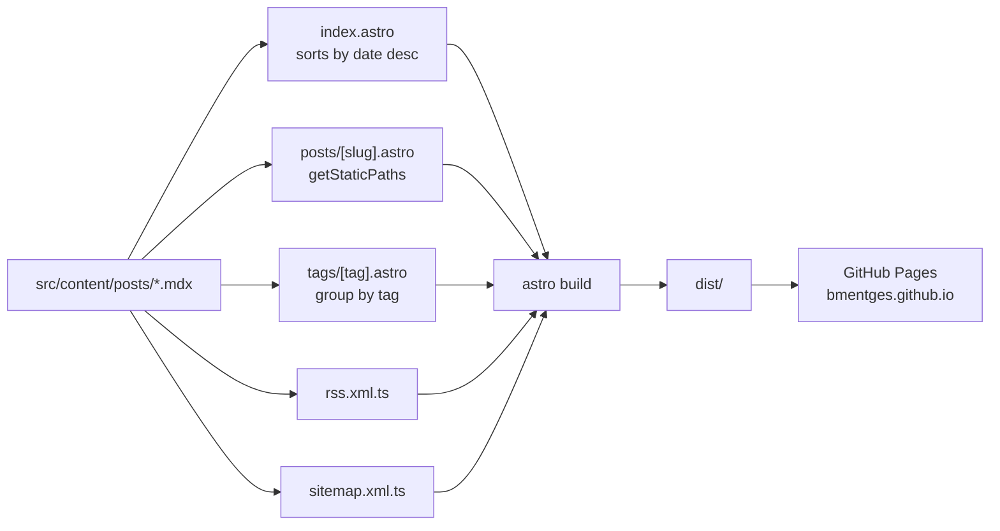

# bmentges.github.io

> Field notes on data engineering and AI, by Bruno Mentges.
>
> Live at **[bmentges.github.io](https://bmentges.github.io)**.

Personal blog. Statically generated, light theme, tuned for long-form reading. Sister site: [mentgesinformatica.com.br](https://mentgesinformatica.com.br) (consultancy) — articles may cross-post between the two; both sides self-canonical.

---

## Stack

- **[Astro 4](https://astro.build)** — static output, no SSR, no client islands
- **MDX** — articles as Markdown + JSX, one file per post
- **Tailwind 3** — utility base layered under a custom CSS-variable design system
- **[Geist](https://vercel.com/font) + Geist Mono** — variable fonts self-hosted via Fontsource
- **GitHub Actions → GitHub Pages** — automated deploy on push to `master`

Zero `<script>` tags shipped. Only CSS and font subsets reach the browser.

## Quick start

```bash
git clone git@github.com:bmentges/bmentges.github.io.git
cd bmentges.github.io
npm install
npm run dev    # http://localhost:4321
```

### Scripts

| Command | Purpose |
|---------|---------|
| `npm run dev` | dev server with hot reload |
| `npm run build` | production build → `dist/` |
| `npm run preview` | serve the built `dist/` locally |
| `npx astro check` | type-check + validate content collections |

No linter or test runner is wired up — intentionally minimal tooling.

## How a post moves through the build



## Project structure

```
src/
├─ components/          Nav, Footer, PostCard
├─ content/
│  ├─ config.ts         Zod schema for the posts collection
│  └─ posts/*.mdx       One article per file
├─ layouts/
│  └─ Layout.astro      Base shell: head, Nav, main slot, Footer
├─ pages/
│  ├─ index.astro       Home
│  ├─ about.astro       About
│  ├─ cv.astro          CV summary
│  ├─ 404.astro
│  ├─ posts/[slug].astro
│  ├─ tags/[tag].astro
│  ├─ rss.xml.ts
│  └─ sitemap.xml.ts
└─ styles/
   └─ global.css        Design tokens + .prose rules

public/
├─ favicon.svg
└─ robots.txt
```

## Adding a post

Create `src/content/posts/<slug>.mdx`:

```mdx
---
title: "The title of the post"
description: "One-line description for cards and social previews."
category: "Data Engineering"
date: 2026-05-01
tags:
  - data-engineering
  - production
published: true
---

Post body in MDX. Inline HTML is fine. SVGs render as-is.
```

The content collection picks it up automatically. The home, tag archives, RSS, and sitemap all refresh on next build.

> **Gotcha:** inside `<code>` spans, markdown still processes — so `bronze_crm_contacts` opens an emphasis that never closes. Escape underscores and curly braces to HTML entities (`&#95;`, `&#123;`, `&#125;`) when embedding identifiers with those characters.

## Design system

All tokens live in `src/styles/global.css` as CSS variables on `:root`. A few decisions worth preserving:

- **Body 18 px, prose 19 px, minimum 17 px** on card descriptions — tuned for readers 40+.
- **Single accent**: emerald `#059669`. A secondary emerald `#34d399` appears only inside SVG diagrams for primary/secondary contrast.
- **4–8 px radii**, single-layer shadows, 1 px hairline borders.
- **Two containers**: `container-marketing` (1120 px) for home/about/CV/tag pages, `container-prose` (720 px) for article reading.
- **Light theme only**, with a soft gradient background and two subtle emerald radial glows. `prefers-reduced-motion` respected; no decorative animations.

## Validation

Before pushing a change:

```bash
npm run build          # fails on bad MDX, broken schema, broken links in astro:content
npx astro check        # TypeScript + content collection check
npm run preview        # eyeball the built site locally
```

## Deployment

Pushes to `master` trigger `.github/workflows/deploy.yml`:

1. `withastro/action@v3` — runs `npm ci` (requires the committed `package-lock.json`) then `astro build`.
2. `actions/deploy-pages@v4` — publishes `dist/` to GitHub Pages.

The workflow opts into Node.js 24 via `FORCE_JAVASCRIPT_ACTIONS_TO_NODE24`, ahead of the June 2026 cutover that deprecates Node 20 on Actions runners.

The `site` URL in `astro.config.mjs` is `https://bmentges.github.io`. If moving to a custom domain, update that value and add a `CNAME` file to `public/`.

## License

Content © Bruno Mentges. Code (layouts, components, styles) is available under the MIT License.
